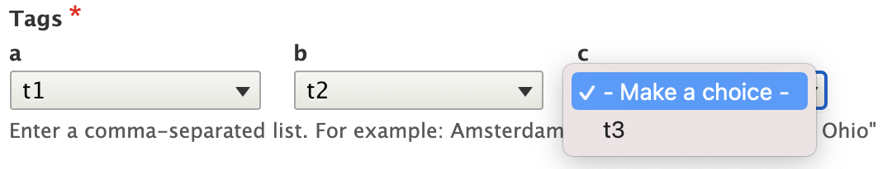
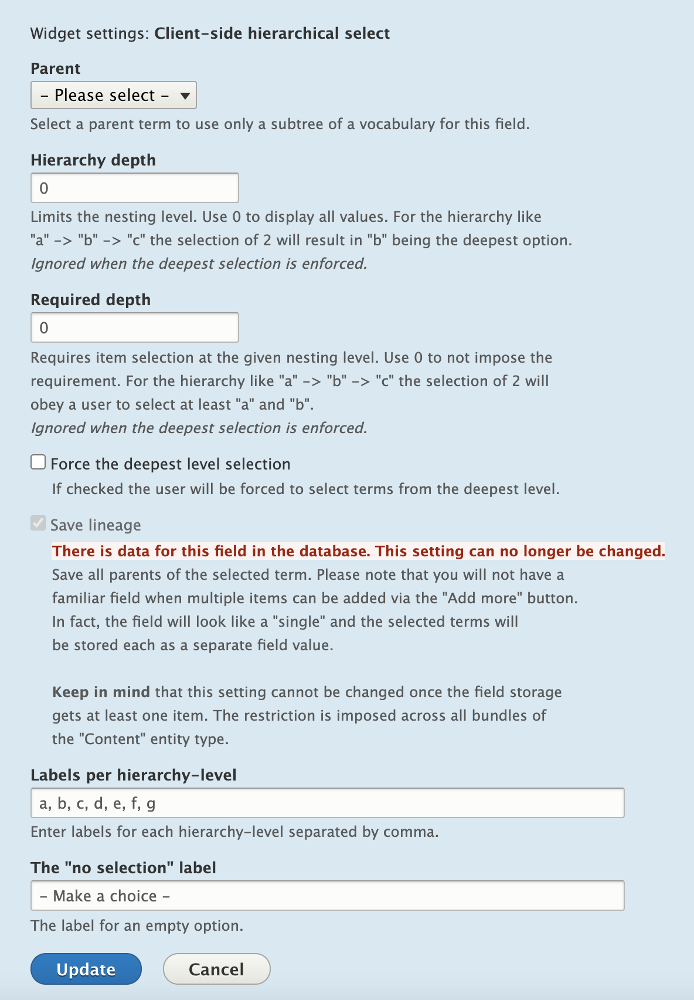

# Client-side Hierarchical Select

The main feature of the project is to provide a field widget for selecting taxonomy terms in a hierarchical fashion.

The module preloads the taxonomy hierarchy and passes it to the client (your brwoser) where it's used to build the subset of the select boxes to allow a user to pick options one by one.



The above widget represents the following hierarchy:

```
| t1
| --| t2
| --| --| t3
```

The field widget has a variety of configuration options:

- The **parent** to start listing from.
- The **hierarchy depth**, to limit the listing.
- The **required depth**, to force picking the number of options.
- The ability to **force picking a value at each level of the hierarchy**.
- The option to **save the entire lineage** from root to child term.
- The ability to **specify a label for each select box** at the given level.



## Features

- **Multilingual** - respects Drupal core internationalization.
- **Views integration** - use the CSHS widget as an exposed filter for taxonomy term reference fields.
- **Developer API** - use `cshs` element in your forms as a replacement of `select`.

## Submodules

- **Menu Link** - a client-side hierarchical selection of parents for the menu link. Works for node and term forms (with [Taxonomy Menu UI](https://www.drupal.org/project/taxonomy_menu_ui) enabled).

## Maintainers

- 8.x, 9.x, 10.x
  - [Sergii Bondarenko (BR0kEN)](https://www.drupal.org/u/BR0kEN)
- 7.x
  - Seeking maintainers. See https://www.drupal.org/project/cshs/issues/3222007

## Similar projects

Looks similar to [SHS](https://drupal.org/project/shs) and [Hierarchical select](https://www.drupal.org/project/hierarchical_select), but in contrast to those modules, the whole taxonomy tree is already present at page-load. The processing is done on the client-side by JavaScript that builds multiple select boxes (one for each level in the hierarchy).
